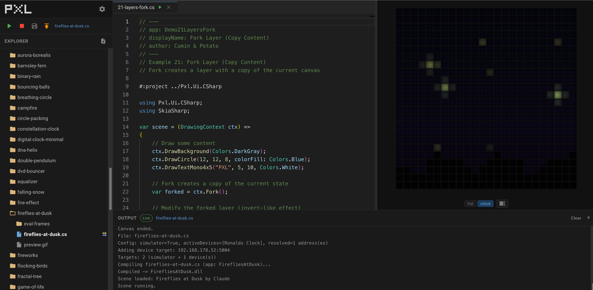

# PXL Clock

A 24x24 pixel display in a handmade frame with real glass. It shows clocks, animations,
short stories - and anything else you can think of.

<p align="center">
  <a href="https://www.pxlclock.com/">
    
  </a>
</p>

<p align="center">
  <a href="https://www.pxlclock.com/"><strong>Get your PXL Clock -> pxlclock.com</strong></a>
</p>

---

## PXL Studio

**[studio.pxlclock.com](https://studio.pxlclock.com/)**

Describe what you want to see, and PXL Studio builds it for you - in the browser, nothing to
install. Watch it run on a simulated clock while you refine it, then send it to your device.

## PXL App

Control your clock from your phone: pick what it shows, set brightness and sleep times,
install new pixograms.

<p align="center">
  <a href="https://apps.apple.com/app/pxl-clock/id6744249645">App Store</a> &nbsp;·&nbsp;
  <a href="https://play.google.com/store/apps/details?id=com.cuminandpotato.pxldev">Google Play</a>
</p>

## Community

Share what you built, ask questions, or just watch what others come up with.

<p align="center">
  <a href="https://discord.gg/KDbVdKQh5j">
    
  </a>
</p>

---

## Writing your own pixograms

[](https://www.nuget.org/packages/Pxl)

A pixogram is a C# script. That is the whole thing - a bouncing ball:

```csharp
#:package Pxl

using Pxl.Ui.CSharp;

double x = 0;

var scene = (RasterSurface ctx) =>
{
    ctx.DrawBackground(Colors.Black);
    ctx.DrawCircle(x, 12, 3, colorFill: Colors.Red);
    x += 0.2;
    if (x > ctx.Width + 3) x = -3;
};
```

The [**VS Code extension**](https://marketplace.visualstudio.com/items?itemName=pxlclock.pxl-clock)
gives you a built-in simulator with hot reload, and publishes to a real clock with one click.
Install it, open this repo, and hit play on any `.cs` file.

<p align="center">
  <a href="https://marketplace.visualstudio.com/items?itemName=pxlclock.pxl-clock">
    
  </a>
</p>

**Examples in this repo:** `apps/demos/` walks from `01-hello-pixel.cs` upwards, and
`llms.txt` is the full API reference - handy to paste into an AI assistant.

Prefer the command line? [`Pxl.Render`](https://www.nuget.org/packages/Pxl.Render)
(`dotnet tool install --global Pxl.Render`) turns any script into a GIF, APNG or video.

---

## Ideas, bugs, contributions

Open an [issue](../../issues) for anything - hardware feedback, feature ideas, bug reports.
Pull requests are welcome too.

[LICENSE.md](LICENSE.md)
