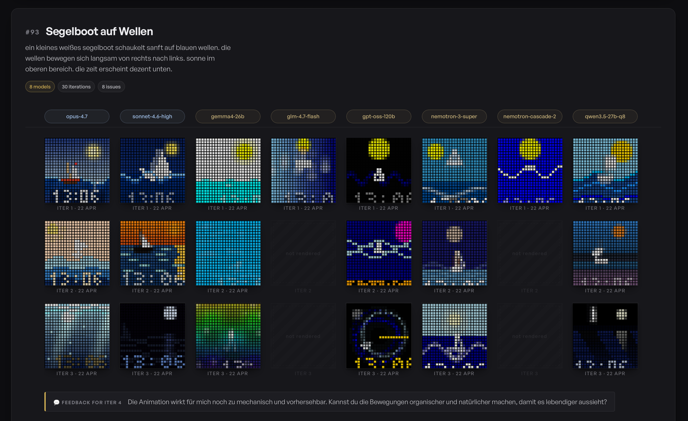

# PXL Clock

**Support my Work**

Buy a **PXL Clock** :)
Use code **RONALD** for a **25€ discount**:

[https://www.pxlclock.com/?ref=RONALD](https://www.pxlclock.com/?ref=RONALD)

PXL Clock is a fun device, made with ❤️ - and it's programmable in an easy and quick way.

<p align="center">
  <a href="https://www.pxlclock.com/?ref=RONALD">
    
  </a>
</p>

Find out more:

- On the [PXL Clock Discord Server](https://discord.gg/KDbVdKQh5j)
- check out the [PXL Clock Repo on GitHub](https://github.com/SchlenkR/pxl-Clock)
- Visit the official [PXL Clock Store](https://www.pxlclock.com/?ref=RONALD)

<p align="center">
  <h3>Join the PXL Clock Community on Discord</h3>
  <a href="https://discord.gg/KDbVdKQh5j">
    
  </a>
</p>

---


Welcome to the **PXL Clock** repository! This repo serves as a central hub for:

- **The Pixogram Gallery** — every pixogram the community and our AI pipeline has produced so far, plus a side-by-side model shootout
- **Resources for creating your own custom PXL Clock Pixograms**
- **Issue tracking** and **idea proposals** (hardware, software, use cases, features)

We're excited to see what the community will build around the PXL Clock. Below you'll find everything you need to get started.

---

## Pixogram Gallery & AI Pipeline

**[Visit the Pixogram Gallery → schlenkr.github.io/pxl-clock](https://schlenkr.github.io/pxl-clock/)**

<p align="center">
  <a href="https://schlenkr.github.io/pxl-clock/">
    
  </a>
</p>

The gallery is a live model shootout. Every GitHub Issue in this repo that describes a visual idea (*"a little sailboat on waves"*, *"Tetris playing itself"*, *"a pixel dragon breathing fire"*) gets picked up by our **Pixogram Maker** — a multi-agent AI pipeline that turns the description into an actual 24x24 animated pixogram, running on several models in parallel.

What you see in each column is the same issue, interpreted by a different model (Claude Opus 4.7, Sonnet 4.6, Gemini, GPT-OSS, Qwen, Nemotron, …). Each row is one iteration — the pipeline loops through roles (Visionary → Craftsman → Implementor → Maverick → …), takes your feedback from the issue comments, and iterates.

### How to get your own pixogram generated

1. **Open an [Issue](../../issues/new/choose)** in this repo describing your idea — plain language, in any language.
2. A maintainer approves it (safety gate — this prevents the pipeline from burning compute on random spam).
3. The AI pipeline runs, posts the generated GIFs back as comments, and they land in the gallery.
4. **Comment on the issue** to steer the next iteration — *"make it bluer"*, *"less mechanical, more organic"*, or *"completely different approach"*. The pipeline reads your feedback and routes to the right agent (specific feedback → Craftsman, vague → Maverick, rejection → Visionary).

### What's under the hood

The Pixogram Maker is itself open source and lives in [`pixogram-maker/`](pixogram-maker/). It's a study in multi-agent AI orchestration: role separation, prompt caching, byte-stable prefixes for local inference, conversation compaction, trust filtering against prompt injection, and so on. If you're into AI pipelines — [**read the full write-up**](pixogram-maker/README.md). It covers everything from Ollama KV-cache tuning on a Mac Studio to mode collapse in RLHF-aligned models.

Backends it runs on: **Anthropic API** (Claude), **GitHub Copilot SDK** (Sonnet, GPT-5.4), and **local Ollama** (Qwen, Gemma, GPT-OSS, Nemotron — all self-hosted on a Mac Studio).

---

## PXL Clock VS Code Extension

The **fastest way** to develop Pixograms is with the official [**PXL Clock VS Code Extension**](https://marketplace.visualstudio.com/items?itemName=pxlclock.pxl-clock). It gives you everything you need in one package:

<p align="center">
  <a href="https://marketplace.visualstudio.com/items?itemName=pxlclock.pxl-clock">
    
  </a>
</p>

- **Built-in Simulator** — starts automatically, no setup required. Live preview of your Pixogram right in VS Code.
- **Live Hot Reload** — save your `.cs` file and see changes instantly in the simulator and on connected devices.
- **Run, Stop, Restart** — one-click controls in the editor toolbar for any `.cs` Pixogram.
- **Publish to Device** — compile and deploy your Pixogram to a real PXL Clock with one click (cloud icon).
- **Device Discovery** — automatically finds PXL Clocks on your local network.
- **IntelliSense & Error Checking** — C# completions, diagnostics, and signature help powered by Roslyn.

**Quick Start:**
1. Install the [PXL Clock VS Code extension](https://marketplace.visualstudio.com/items?itemName=pxlclock.pxl-clock)
2. Open this repo in VS Code
3. The built-in simulator starts automatically in the background
4. Click a `.cs` file in the **Pixograms** panel and hit the play button
5. Watch the preview in the sidebar or open a full-size simulator with `PXL Clock: Open Simulator`

**Examples:** Start with `apps/demos/01-hello-pixel.cs` and work your way up through the numbered demos. Also check out the clock faces in `apps/clockFaces/` for more advanced examples.

---

## Table of Contents

1. [Pixogram Gallery & AI Pipeline](#pixogram-gallery--ai-pipeline)
2. [PXL Clock VS Code Extension](#pxl-clock-vs-code-extension)
3. [About PXL Clock](#about-pxl-clock)
4. [Filing Issues and Ideas](#filing-issues-and-ideas)
5. [Developing Your Own Pixograms](#developing-your-own-pixograms)
6. [Rendering Pixograms (Pxl.Render)](#rendering-pixograms-pxlrender)
7. [Contributing](#contributing)
8. [License](LICENSE.md)

---

## About PXL Clock

The **PXL Clock** is a device designed to display various fun clocks, animations, short stories, visuals and other creative things - all on a 24x24 pixel display. Whether you want to keep track of the current time in a futuristic manner or develop your own Pixograms to run on the clock, this project provides a flexible platform for creativity.

---

## Filing Issues and Ideas

Have an idea for a new feature or discovered a bug? Help us improve the PXL Clock by creating a new issue in this repository. We welcome:

- Hardware-related feedback or design modifications
- Software feature requests, improvements, or bug reports
- Use case suggestions or creative ways to integrate PXL Clock into your projects

Just head over to the [**Issues**](../../issues) tab and click **New Issue** to get started.

---

## Developing Your Own Pixograms

[](https://www.nuget.org/packages/Pxl)
[](https://www.nuget.org/packages/Pxl)

### Prerequisites

- [.NET 10 SDK](https://dotnet.microsoft.com/en-us/download/dotnet/10.0)
- [VS Code](https://code.visualstudio.com/) with the [PXL Clock extension](https://marketplace.visualstudio.com/items?itemName=pxlclock.pxl-clock)

Run `./build/setup-check.sh` to verify your setup.

### Getting Started with Code

A PXL Clock Pixogram is a simple C# script. Here's a minimal example — a bouncing ball:

```csharp
#:package Pxl

using Pxl.Ui.CSharp;

double x = 0;

var scene = (DrawingContext ctx) =>
{
    ctx.DrawBackground(Colors.Black);
    ctx.DrawCircle(x, 12, 3, colorFill: Colors.Red);
    x += 0.2;
    if (x > ctx.Width + 3) x = -3;
};
```

Or display the current time with a blinking colon:

```csharp
#:package Pxl

using Pxl.Ui.CSharp;

var scene = (DrawingContext ctx) =>
{
    ctx.DrawBackground(Colors.DarkBlue);
    ctx.DrawTextMono4x5(ctx.Now.ToString("HH:mm"), 0, 2, Colors.White);
    ctx.DrawTextMono4x5(ctx.Now.Second.ToString("00"), 8, 10, Colors.Yellow);
    if (ctx.Now.Millisecond < 500)
    {
        ctx.DrawPoint(12, 18, Colors.White, strokeWidth: 2);
        ctx.DrawPoint(12, 21, Colors.White, strokeWidth: 2);
    }
};
```

Find many more examples in `apps/demos/` (numbered tutorials from basics to advanced) and in `apps/clockFaces/` (the factory clock face Pixograms that ship with every PXL Clock).

### Using Images and Assets

You can use images in your Pixograms by placing them in an `assets/` folder next to your script. Supported formats: **PNG**, **GIF** (animated), and **JPEG**.

```csharp
// Load a static image
var logo = Image.LoadSingleImage("assets/logo.png");
ctx.DrawImage(logo.Resize(24, 24), 0, 0);

// Load an animated GIF
var animation = Image.LoadAnimatedGif("assets/mario.gif");
ctx.DrawImage(animation.Resize(24, 24), 0, 0, repeat: true);

// Load a sprite sheet and create animations from it
var sprites = Image.LoadSingleImage("assets/pacman_sprite.png")
    .Crop(left: 456, top: 0, right: 0, bottom: 0)
    .ToSpriteMap(cellWidth: 16, cellHeight: 16, frameDurationMs: 80);
var pacman = sprites.CreateAnimation((0, 0), (0, 1), (0, 2), (0, 1));
ctx.DrawImage(pacman, x, y);
```

**Important:** Asset paths must be **string literals** (not variables). The compiler embeds the assets into your Pixogram at compile time. Images are automatically scaled — use `.Resize(width, height)` to fit the 24x24 display.

See `apps/demos/30-image-static.cs`, `31-image-animated-gif.cs`, and `32-pacman-sprites.cs` for complete examples.

### Send to Device (Live Preview)

While developing, you can stream your Pixogram live to a real PXL Clock — so you see exactly how it looks on the hardware, not just in the simulator.

1. In the **PXL-App**, go to your clock's **Settings** and set the mode to **"Development"**.
2. In the VS Code extension's **Simulator** panel, your PXL Clock will be discovered on the network. You can also manage devices there.
3. Save your `.cs` file — the running Pixogram is sent to the clock in real time, just like the simulator preview.

This is purely for development — the Pixogram runs as long as your computer is connected.

### Publish to PXL Clock

Once you're happy with your Pixogram, you can **publish** it to the clock so it runs standalone — without your computer.

1. Click the **Publish** button (cloud icon) on any `.cs` file in the editor toolbar or file tree.
2. Pick the target device from the list — the Pixogram gets compiled and installed on the clock.

After publishing, switch the clock back to normal mode in the PXL-App. Your Pixogram will appear in the Pixogram list alongside the built-in clock faces, controllable via the app.

---

## Rendering Pixograms (Pxl.Render)

[](https://www.nuget.org/packages/Pxl.Render)

**Pxl.Render** is a command-line tool that renders your Pixograms to animated images or video — perfect for creating previews, thumbnails, social media posts, or documentation assets. No PXL Clock device needed.

### Installation

```bash
dotnet tool install --global Pxl.Render
```

### Basic Usage

```bash
# Render a 10-second GIF preview
pxl-render MyClock.cs -o preview.gif -d 10

# Render with the "clock" look (LED glow effect), scaled up 10x
pxl-render MyClock.cs -o preview.gif -s 10 -m clock

# Render with flat style (visible gaps between LEDs)
pxl-render MyClock.cs -o preview.gif -s 10 -m flat

# Animated PNG (full 24-bit color, no dithering artifacts)
pxl-render MyClock.cs -f apng -o preview.png

# Animated WebP (smaller file size than GIF)
pxl-render MyClock.cs -f webp -o preview.webp

# Export individual PNG frames
pxl-render MyClock.cs -f png -o frames/ -d 3

# Pipe raw RGB to ffmpeg for video encoding
pxl-render MyClock.cs -f stdout -s 10 | ffmpeg -f rawvideo -pix_fmt rgb24 -s 240x240 -r 40 -i - output.mp4
```

### Options

| Option | Description | Default |
|--------|-------------|---------|
| `-o, --output <path>` | Output file or directory | `output.gif` |
| `-f, --format <fmt>` | `gif`, `apng`, `webp`, `png`, `pxl`, `stdout` | `gif` |
| `-d, --duration <secs>` | Duration to render (seconds) | `5.0` |
| `--fps <int>` | Frames per second | `40` |
| `-s, --scale <int>` | Scale factor (e.g., `10` = 240x240 output) | `1` |
| `-m, --mode <mode>` | Render mode: `raw`, `flat`, `clock` | `raw` |
| `--gap <float>` | Pixel gap (fraction of cell size) | auto |
| `-t, --timelapse <int>` | Keep every Nth frame (speeds up output) | `1` |
| `--start-time <datetime>` | Virtual start time (for clock faces) | current UTC |
| `--stdin` | Read script from stdin | — |

### Render Modes

- **`raw`** — Direct pixel output, 1:1 with the display. No gaps between pixels.
- **`flat`** — Adds small gaps between pixels, giving a grid/matrix look.
- **`clock`** — Simulates the LED glow effect of a real PXL Clock with radial dimming and hotspots. Closest to how it looks on the actual device.

---

## Contributing

Contributions from the community are highly encouraged. If you want to help make PXL Clock better, you can:

1. **Create an Issue:** File a new issue for suggestions, bug reports, or feature requests.
2. **Submit a Pull Request:** Fork this repo, make your changes, and submit a pull request. Make sure to include a clear description of what you've changed or fixed.

Please be respectful and constructive. Join our [Discord community](https://discord.gg/KDbVdKQh5j) if you have questions or want to discuss ideas.

---

see: [LICENSE.md](LICENSE.md)

---

Thank you for your interest in the PXL Clock! We look forward to seeing your ideas and contributions. If you have any questions or suggestions, feel free to open an issue or start a discussion. Let's make time more fun—together!
